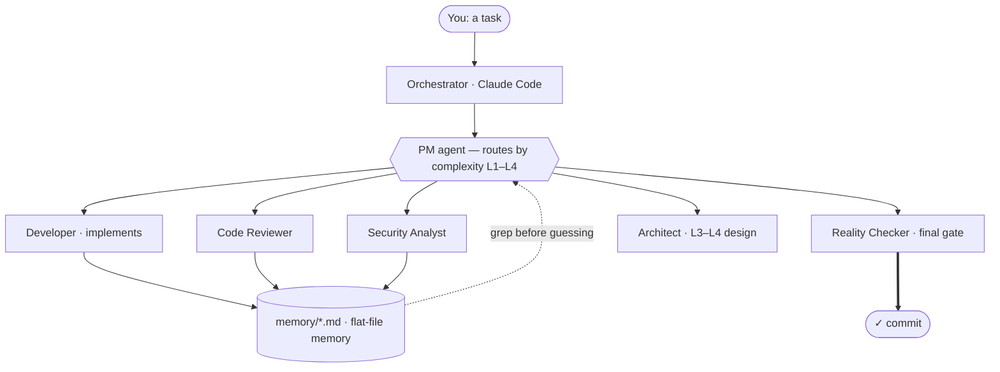

<div align="center">

# Forge ⚒️

### Turn Claude Code into a disciplined dev team — not one sprawling chat.

A PM agent orchestrates specialized agents that implement, review, test, and ship.
Roles are **mechanically enforced**, memory lives in **plain files**, and state
**survives context compaction**. No service, no vector DB, no infra to host.



[](LICENSE)


</div>

---

## The problem

- **One giant Claude session drifts.** It forgets decisions after a compaction, loses the thread on long runs, and edits whatever file it feels like.
- **"Agent framework" tools** (AutoGen, CrewAI, AutoGPT) want you to write Python orchestration, stand up a vector DB, and babysit infra — just to coordinate a few roles.
- **Role boundaries that live only in prompts get ignored** the moment the model is confident enough to "just fix it."

**Forge fixes this inside Claude Code itself** — with hooks that actually enforce the rules, flat files instead of services, and a pipeline that scales to the task.

## Why Forge

|                                          | **Forge** | Raw Claude Code | AutoGen / CrewAI / AutoGPT |
|------------------------------------------|:---------:|:---------------:|:--------------------------:|
| Runs **inside Claude Code** (no runtime) | ✅        | ✅ (1 session)  | ❌ (Python host)           |
| Roles **enforced by hooks**, not prompts | ✅        | ❌              | ⚠️ (code, not guards)      |
| Memory with **no service** (flat files)  | ✅        | ⚠️ (manual)     | ❌ (vector DB)             |
| **Survives** context compaction          | ✅        | ❌              | ⚠️                         |
| Pipeline **scales to task** (L1–L4)      | ✅        | ❌              | ⚠️                         |
| **Zero infra / DB / daemon**             | ✅        | ✅              | ❌                         |

## Quickstart

```bash
git clone https://github.com/ajadi/forge.git

# install into your project (pick a preset)
bash forge/install.sh /path/to/your/project --preset solo        # 13 core agents
bash forge/install.sh /path/to/your/project --preset full        # 37 agents

# then open the project in Claude Code and run:
/f-start
```

Prefer it everywhere? `bash forge/install-global.sh` installs the agents/commands/skills
into `~/.claude/`, then `/f-setup-project` wires any folder.

## How it works

You give the PM agent a task. It assesses complexity and routes it through the *matching* pipeline — no full ceremony for a typo, full rigor for a feature.

| Level | What | Pipeline |
|-------|------|----------|
| **L1** | One-line fix | Developer → RealityCheck → commit |
| **L2** | Small change | Developer → CodeReview → RealityCheck → commit |
| **L3** | Feature | Architect → Developer → CodeReview + Security → UnitTest → RealityCheck → commit |
| **L4** | Major feature | Full pipeline + design panel (Consilium) |



Four things keep it from drifting, leaking, or running up cost:

- **Mechanically enforced roles** — a `Write|Edit` guard hook stops the PM and read-only agents from editing source. Boundaries are enforced, not just documented.
- **File-based memory** — project knowledge lives in `memory/*.md`; agents grep before they guess, append after tasks, mark superseded facts `~~strikethrough~~`. No service, no embeddings, nothing to install.
- **Token economy** — large non-source reads are delegated to a cheap model; noisy shell output is trimmed before it reaches context. The reasoning model stays on code.
- **Long-session durability** — state is dumped before compaction and rehydrated exactly once after, so long runs don't lose the thread.

> **Note — the token-economy read-delegation needs a *second*, cheap model** (e.g. xAI Grok via the [`coworker`](core/docs/coworker-setup.md) CLI). It is **optional**: if `coworker` isn't installed the read-gate **fails open** (every read is allowed), so Forge runs fully without it — you opt in for the savings. It only ever sends *non-source* files to that model, never your code. See [core/docs/coworker-setup.md](core/docs/coworker-setup.md).

## Status

Forge is **v2.4**, MIT-licensed, and used in real multi-agent builds.

- ✅ Complexity-routed pipeline (L1–L4) with 13 core + 24 extension agents
- ✅ Hook-enforced role boundaries, commit/push guards, production-safety stop
- ✅ Flat-file memory protocol + repo-access modes (private/shared/public)
- ✅ Long-session durability (pre-compact dump + one-shot rehydrate), token economy
- ✅ Autopilot — run a backlog end-to-end, halt only on questions/regressions/deploys
- 📋 Roadmap — richer memory via [Ember](https://github.com/ajadi/ember) (see below)

## Pairs with Ember 🔥

Forge's built-in memory is flat Markdown files — zero-config and perfect for most projects.
For **semantic recall across sessions and machines**, pair it with
[**Ember**](https://github.com/ajadi/ember) — a local-first MCP memory server (SQLite +
on-device embeddings + tiered retrieval). Forge ships an optional capture adapter that
feeds pipeline events (PM steps, reality-checks, decisions, retrospectives) straight into
Ember. Use either alone, or both together.

## Token economy — optional read-delegation (`coworker`)

Forge can offload **large non-source reads** (docs, logs, data, boilerplate) to a
**separate cheap model** — [`coworker`](core/docs/coworker-setup.md), backed by xAI Grok —
keeping the reasoning model's context on your code. It is **opt-in and safe by default**:

- If `coworker` isn't installed, the read-gate **fails open** — every read is allowed and Forge runs fully without it.
- **Source code is never sent** to the cheap model — only non-source files, and only above a size threshold.

**The threshold is yours to set** — `COWORKER_DELEGATE_TOKENS` (default **5000** tokens, ≈ 20 KB): non-source files at/above it are delegated to coworker, smaller ones are read in-context. Grok is far cheaper, so **lower it** (e.g. `3000`) to save more aggressively, or **raise it** (e.g. `10000`) to keep more in the reasoning model — below ~`2000` the per-call overhead outweighs the gain. Files at/above `COWORKER_GREP_TOKENS` (default `100000`) are grep-only; source is always exempt. Full setup + privacy notes: [core/docs/coworker-setup.md](core/docs/coworker-setup.md).

---

<details>
<summary><b>Hooks</b> — what runs when (all fail open)</summary>

| Hook | Event | What it does |
|------|-------|-------------|
| `session-start` · `detect-gaps` | SessionStart | Load context; reset turn counter; warn on missing files |
| `contract-reminder` | UserPromptSubmit | Re-inject operating contract + active task objective/done-criteria |
| `rehydrate` | UserPromptSubmit | After compaction, one-shot re-inject of critical state, then silent |
| `turn-counter` | UserPromptSubmit | Session depth meter; soft-warn to checkpoint (default 40 turns) |
| `validate-commit` · `validate-push` | PreToolUse(Bash) | Block `--no-verify`, force-push, staged `.env`, framework leaks |
| `bash-filter` | PreToolUse(Bash) | Trim noisy commands to lean forms (token saver) |
| `coworker-read-gate` | PreToolUse(Read) | Delegate large non-source reads to a cheap model; source exempt |
| `role-write-guard` | PreToolUse(Write\|Edit) | Enforce AGENTS.md boundaries — PM/read-only roles can't edit source |
| `check-blockers` | PostToolUse(Task) | Detect open questions after an agent runs |
| `pre-compact` | PreCompact | Dump full state to a durable snapshot + set rehydrate marker |
| `stop-check` · `session-stop` | Stop | Block stopping mid-pipeline or with unrecorded source changes |

**Tuning knobs:** `COWORKER_READ_GATE` (off to disable), `COWORKER_DELEGATE_TOKENS` (read-delegation threshold — see [Token economy](#token-economy--optional-read-delegation-coworker) above), `ROLE_WRITE_GUARD`, `FORGE_BASH_FILTER`, `FORGE_DEPTH_SOFT`, …

</details>

<details>
<summary><b>Agents & extensions</b></summary>

**Core (13, always installed):** pm · developer · code-reviewer · reality-checker ·
architect · business-analyst · decomposer · handoff-validator · unit-tester ·
database-architect · rapid-prototyper · context-summarizer · status

**Extensions (install per need):**

| Extension | Agents | Best for |
|-----------|--------|----------|
| ext-security | security-analyst, dependency-auditor | APIs, auth, web apps |
| ext-frontend | smoke/e2e-tester, ui-designer, ux-interviewer, a11y | UI/UX |
| ext-devops | devops, env-manager, git-workflow, migration-validator | CI/CD, deploys |
| ext-quality | performance-profiler, refactoring, test-reviewer, integration-tester | Large codebases |
| ext-docs | documentation, changelog-agent | OSS / teams |
| ext-planning | estimator, consilium | L3–L4 planning |
| ext-reflection | reflect, dream, optimizer, onboarding, retro, platform-sync | Long-running projects |

</details>

<details>
<summary><b>Key commands</b></summary>

All user-invocable commands use the `f-` namespace to avoid collision with built-ins.

| Command | What it does |
|---------|-------------|
| `/f-start` | Guided onboarding for a new project |
| `/f-fix TASK-XXX` | Quick fix — run PM on a specific task |
| `/f-decompose` | Break a feature into parallelizable tasks |
| `/f-autopilot` | Run the backlog end-to-end; halt only on questions/regressions/deploys |
| `/f-status` · `/f-next-task` | Project state / what to do next |
| `/f-audit` | Adaptive multi-agent project audit swarm |
| `/f-hotfix` | Emergency fix bypassing the normal pipeline |
| `/f-spike` | Technical spike to validate a hypothesis |

</details>

<details>
<summary><b>Install details, repo-access modes, prerequisites</b></summary>

**Install flags:** `--preset solo|small-team|full`, `--ext name1,name2`, `--name "..."`,
`--rollback`, `--apply-proposal`, `--list`. Every run backs up `CLAUDE.md`, `settings.json`,
`manifest.md`, `.gitignore` to `.claude/backup-TIMESTAMP/`; `CLAUDE.md` is merged additively,
hard conflicts pause with a proposal file instead of overwriting.

**Repo-access modes** (`manifest.md` → `repo_access`, default `private-solo`): controls whether
framework state (`.claude/`, `memory/`, `tasks/`, `CLAUDE.md`) is committed. Switch before the
first shared/public commit:

```bash
scripts/switch-repo-access.sh public --commit
```

**Prerequisites:** Claude Code CLI · Git Bash on Windows (hooks use `#!/bin/bash`) ·
Python 3.9+ *(optional — only for merging an existing `CLAUDE.md`/`settings.json`)*.

</details>

<details>
<summary><b>Troubleshooting</b></summary>

| Problem | Fix |
|---------|-----|
| Hooks error on Windows | Make Git Bash the default shell — hooks use `#!/bin/bash`. |
| `python3` not found | On Windows Python installs as `python`; Forge handles it (Python is optional). |
| Empty `memory/` on first run | Not an error — memory seeds itself as tasks close. |
| `install.sh` exits code 2 | Hard `CLAUDE.md` conflict — read `.claude/CLAUDE.md.merge-proposal.md`, then `install.sh --apply-proposal` (or `--rollback`). |
| Framework files leaked to a public branch | `switch-repo-access.sh` blocks the switch; use `git filter-repo` or cut a fresh branch. |

</details>

## Credits

Pipeline ideas (autonomy ladder, stop rules, handoff contracts, Ralph Loop, escalation
matrix) inspired by [alexeykrol/coursevibecode](https://github.com/alexeykrol/coursevibecode).

## License

[MIT](LICENSE) © 2026 David Sandler
